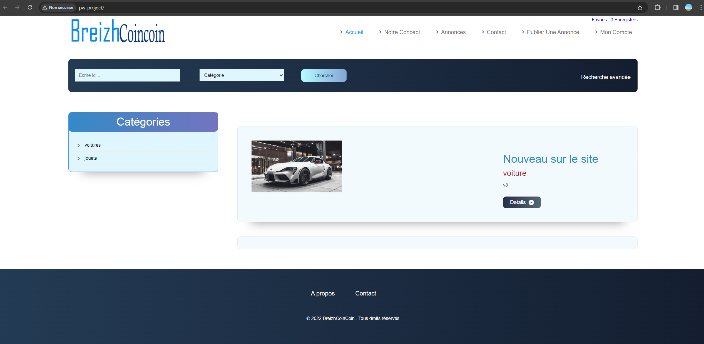
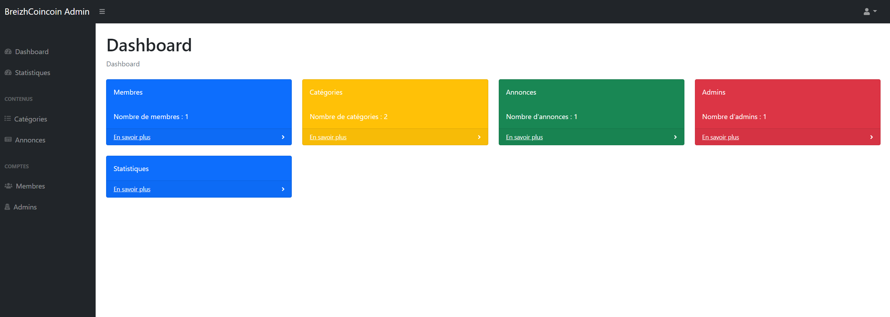

# Flxcars
*Website based on online shop style. (In french)*

## Goal
In this project, my objective was to enhance my web programming skills by utilizing various tools such as PHP, JavaScript, and MySQL for the database.

## Preview

1. Index of the website
   
2. Cars page ( where u can find your dream car)
   

## How to install the project

Firstly, you will need an web development environment like [WampServer](https://www.wampserver.com/) or [Xamp](https://www.apachefriends.org/fr/index.html).

After that, you will need to setup the database. The config file is in **/bdd/pw.sql**.
Make sure to import this file in your database and it would be fine.

Final task : In the file **"database.php"** which is in **/actions/database.php**, you need to change the username and password on the third line.

That's it ! Enjoy the project ! :)

## Structure

This website is primarily coded in PHP, with some JavaScript scripts.
